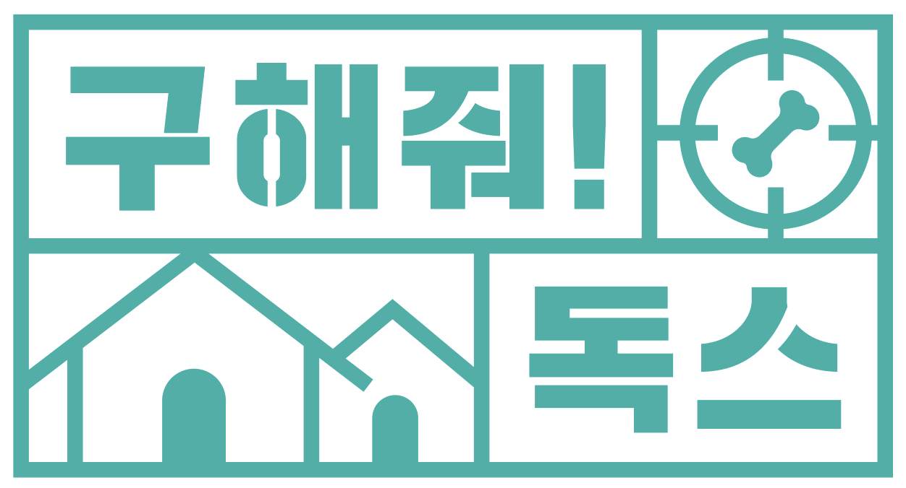
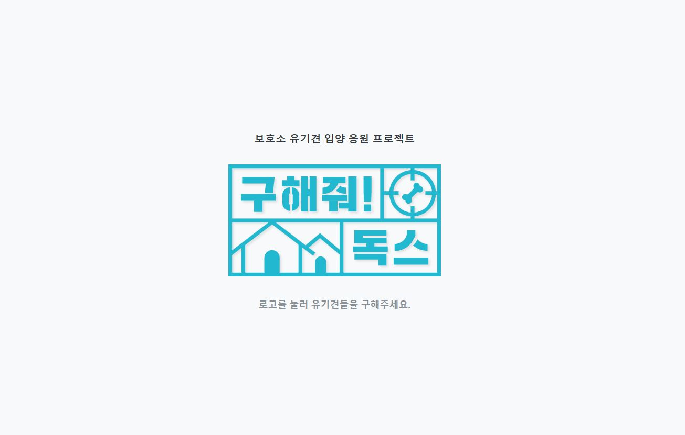
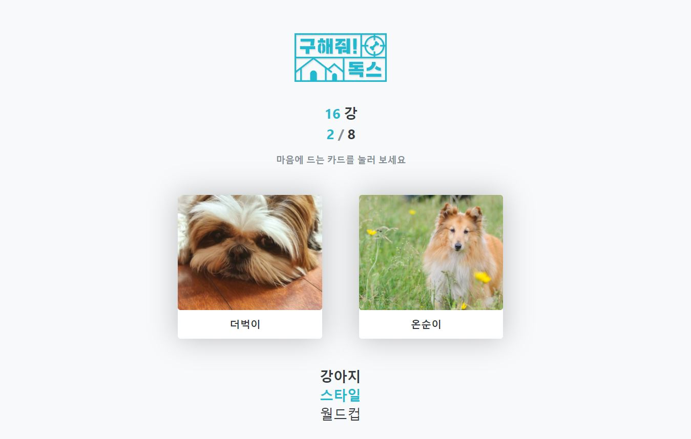

# 🐶 구해줘! 독스

	

 

  
  
  
  

> 세상에 귀여운 강아지는 많고 그 중에서 우리의 손길이 필요한 강아지도 너무 많다! 본격 유기견&믹스견 알아보기 프로젝트

## 🧐 구해줘! 독스는❓
- 유기견들에 대한 인식은 점차 높아지고 있지만, 여전히 뚜렷한 품종이 구별되지 않는 믹스견들은 외면받고 있습니다.
- 그래서 전통적인 품종이 아닌 자체적으로 구별한 특징을 바탕으로 믹스견 월드컵을 통해 믹스견의 매력을 알리고자 합니다.
- 가장 좋아하는 믹스견이 결정되면, 그와 비슷한 유기견 아이들을 함께 보여줍니다.
- 이 서비스를 기회로 보다 많은 사람들이 믹스견, 그리고 유기견에 대해 한 번 더 생각해보게 되었으면 좋겠습니다😊

## 💁‍♂️ Service workflow

> 시작

	

- 초기 시작 뷰입니다. 클릭하면 강아지 월드컵이 시작됩니다.

> 월드컵

	

- 월드컵 뷰입니다. 저희의 믹스견 분류에 따라 더 마음에 드는 쪽을 선택합니다.

## 📚 API Docs
* [Api Description Link](https://github.com/busking22/saveDogs/wiki)

## :computer: 역할 분담

- 👨‍💻[오태진](https://github.com/ORANZINO): 유기동물 데이터 전처리 및 DB 구성
- 👨‍💻[황성현](https://github.com/busking22): 컴포넌트 구현 & 프로젝트 Repository 관리
- 👩‍💻[김현지](https://github.com/ekfvnddl99): 믹스견 월드컵 프론트엔드 로직 구축
- 👨‍💻[고광서](https://github.com/rufflain): UI/UX 디자인 및 서비스 애니메이션 구현
- 👨‍💻[한승준](https://github.com/hsjun99): 서버 로직 설계 및 배포
- 👨‍💻[이연재](https://github.com/potomatoo): 믹스견 라벨링 및 API 통신 설계 및 구축

